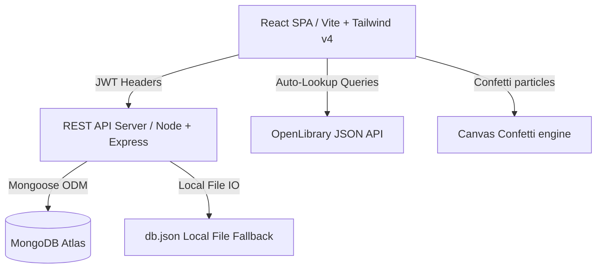

# Virtual Bookshelf 📚

### *Your Personal Digital Library & Reading Journey Tracker*

[](https://vitejs.dev/)
[](https://reactjs.org/)
[](https://tailwindcss.com/)
[](https://nodejs.org/)
[](https://expressjs.com/)
[](https://www.mongodb.com/)
[](https://opensource.org/licenses/MIT)

Virtual Bookshelf (developed as **The Reader's Library**) is a premium, highly immersive digital destination for readers who treat their books not as flat databases, but as treasured intellectual artifacts. The experience evokes walking into a private scholar's cozy, candlelit library at 9 PM—surrounded by polished walnut shelves, rare editions, brass fixtures, and a leather-bound reading journal.

---

## 🖼️ Project Showcase


---

## 📖 Project Overview

Most book trackers represent reading histories in flat tables, corporate grids, or commercial lists. Virtual Bookshelf is built on the philosophy of **Environmental Storytelling**. It brings physical collector pride to the browser by rendering books standing vertically on solid walnut shelves, scaling visual thickness to page count, and animating interactions using physics-based transitions. 

It provides an intuitive interface for cataloging volumes, recording lessons in a paper-lined journal, capturing favorite quotes, and reviewing timelines—all while tracking annual/monthly reading goals and contributions via an elegant metadata dashboard.

---

## ✨ Key Features

### 🪵 Immersive Bookshelf Visualization
* **Solid Walnut Shelves**: Shelf tiers rendered with realistic deep wood-grains, top-down radial candlelights, and glowing drop-shadows.
* **Realistic Book Spines**: Volumes feature bound ridge ribs, gold margins, custom leather/linen textures, and heights matching their page weight.
* **Rivet Brass Plates**: Shelves labeled with classic brass plates centered on shelf boards.

### 📔 Collector's Reading Journal
* **Slide-Out Paper Log**: Detailed views slide out as custom leather diaries with warm cream-lined paper pages (`#f4e8d0`).
* **Handwritten Insights**: Reviews and takeaways styled in handwriting cursive fonts (`La Belle Aurore`) for a tactile notebook feel.
* **Candlelight Star Ratings**: Interactive star ratings supporting half-star increments that animate on mouseover.

### 🔍 Smart Autocomplete Lookup
* **OpenLibrary Search API**: Live, debounced search that queries title keywords, displaying matches with covers.
* **Instant Autofill**: Selected records automatically load author names, page counts, genres, and cover assets.

### 🧠 My Knowledge Vault
* **Second-Brain Cards**: A searchable dashboard consolidating all key notes, takeaways, and favorite quotes across your library.
* **Context Cards**: Quotes and notes link back to the book details drawer.

### 📅 Chronological Reading History
* **Grouped Timelines**: Vertical tracks organizing books by the year they were read.
* **Read Span Tracking**: Displays start/end dates and calculates read durations automatically.

### 📊 Reading Analytics
* **Goal Progress Rings**: Dual dashboard rings displaying monthly and annual completions.
* **Confetti Celebration**: Gold/cream canvas particle explosions when achieving annual targets.
* **Contribution Heatmap**: A 52-week contribution calendar tracking cataloging actions.

---

## 📸 Screenshots

| Bookshelf Sanctuary (Walnut Night) | Reading Journal Details |
| :---: | :---: |
|  |  |

---

## 🛠️ Technology Stack

| Layer | Technology | Purpose |
|---|---|---|
| **Frontend SPA** | React 19 / Vite | Lightning-fast page updates and dev server reloading |
| **Styling** | Tailwind CSS v4 | Class-based layout configuration and CSS theme hooks |
| **Animations** | Framer Motion | Fluid spring physics for spine lifts, tilts, and sliding overlays |
| **Icons** | Lucide React | Clean, high-legibility vector graphics |
| **Celebrations** | Canvas Confetti | Celebrates reading milestone completions |
| **Backend REST** | Node.js / Express | Modular route dispatching and request parsing |
| **Database ODM** | MongoDB / Mongoose | Scalable document modeling with JSON fallback interfaces |
| **Security** | JSON Web Tokens & Bcryptjs | Protected route authorization and hashed passcode storage |

---

## 📐 Architecture Overview



---

## 📂 Folder Structure

```
├── backend/
│   ├── config/          # Mongoose database & Local JSON DB configurations
│   │   ├── db.js
│   │   └── localDb.js
│   ├── middleware/      # JWT route authorization guards
│   │   └── auth.js
│   ├── models/          # MongoDB/Mongoose schemas
│   │   ├── User.js
│   │   └── Book.js
│   ├── routes/          # REST routing controllers
│   │   ├── auth.js
│   │   ├── books.js
│   │   └── stats.js
│   ├── data/            # Excluded runtime database output (db.json)
│   ├── server.js        # Backend entry server script
│   └── .gitignore
│
└── frontend/
    ├── public/          # Static assets and fonts
    ├── src/
    │   ├── components/  # Core drawer, spine, shelf, and dialog elements
    │   │   ├── AddBookModal.jsx
    │   │   ├── BookDrawer.jsx
    │   │   ├── BookSpine.jsx
    │   │   └── ShelfRow.jsx
    │   ├── context/     # Global state AuthContext manager
    │   │   └── AuthContext.jsx
    │   ├── pages/       # Navigation panels
    │   │   ├── Bookshelf.jsx
    │   │   ├── KnowledgeVault.jsx
    │   │   ├── Timeline.jsx
    │   │   ├── Stats.jsx
    │   │   └── Login.jsx
    │   ├── App.jsx      # Unified layout routing container
    │   ├── index.css    # Typography, wood grains, shimmers, and themes
    │   └── main.jsx
    ├── vite.config.js
    └── package.json
```

---

## 📥 Installation Guide

### Prerequisites
* **Node.js** (v20.x or higher recommended)
* **MongoDB** (Optional. The server automatically spins up a local file fallback if MongoDB is not running).

### Setup Steps
1. **Clone the Repository**
   ```bash
   git clone https://github.com/yourusername/virtual-bookshelf.git
   cd virtual-bookshelf
   ```

2. **Backend Installation**
   ```bash
   cd backend
   npm install
   ```

3. **Frontend Installation**
   ```bash
   cd ../frontend
   npm install
   ```

---

## ⚙️ Environment Variables

Create a `.env` file in the `/backend` folder with these values:

```env
PORT=5000
MONGODB_URI=mongodb://127.0.0.1:27017/readers_library
JWT_SECRET=readers_library_secret_key_2026_cozy
```

---

## 💻 Running Locally

### 1. Launch the Backend Server
```bash
cd backend
npm run dev
```
*The API server will run at `http://localhost:5000`.*

### 2. Launch the Frontend Client
```bash
cd frontend
npm run dev
```
*Vite dev server will host the application at `http://localhost:5173`.*

---

## 🗄️ Database Setup

* **Production Mode**: Ensure MongoDB is running on your machine or configure `MONGODB_URI` in `backend/.env` with your MongoDB Atlas connection URL.
* **Demo / Offline Mode**: If Mongoose fails to connect within `2000ms`, the system automatically switches to the built-in JSON file database (`backend/data/db.json`). This ensures 100% features functionality without installing external databases.

---

## 📖 Usage Guide

1. **Accessing the Sanctuary**: Open `http://localhost:5173`. Click **Demo Guest Access (One Click)** to immediately sign in and pre-seed the shelves.
2. **Cataloging**: Click **Catalog Book**, search for titles (e.g. *Meditations*), and select a match to automatically load all metadata.
3. **Journaling**: Click on any book spine. In the cream journal, write notes, save quote excerpts, select ratings, and save reviews.
4. **Themes**: Toggle the **Theme** button in the sidebar to alternate between **Walnut Night** and **Charcoal Espresso** themes.

---

## 📡 API Overview

All routes require a bearer token: `Authorization: Bearer <token>`.

| Endpoint | Method | Purpose |
|---|---|---|
| `/api/v1/auth/register` | `POST` | Create a new user account |
| `/api/v1/auth/login` | `POST` | Authenticate credentials and return token |
| `/api/v1/auth/demo` | `POST` | One-click entry and mock database seeding |
| `/api/v1/auth/goals` | `PUT` | Update annual/monthly target counts |
| `/api/v1/books` | `GET` | Fetch user books (supports search and filter) |
| `/api/v1/books` | `POST` | Catalog a new volume |
| `/api/v1/books/:id` | `PUT` | Update details (status, rating, journal) |
| `/api/v1/books/:id/notes` | `POST` | Add key insight takeaway |
| `/api/v1/books/:id/quotes` | `POST` | Capture quote excerpt |
| `/api/v1/stats` | `GET` | Retrieve progress rings and contribution datasets |

---

## 🗺️ Future Roadmap

### 🤖 AI Core Integrations
* **AI Book Recommendations**: Smart recommendations based on current genres and average scores.
* **Reading Insights**: Aggregated key concepts and reading pattern analyses.

### 👥 Social Collectives
* **Shared Shelves**: Curated shelves shared among reading circles.
* **Friend Libraries**: Visit other scholars' sanctuaries.

### ⚙️ Advanced Features
* **Goodreads Import**: Seamlessly import existing bookshelf histories.
* **PDF Metadata Extractor**: Auto-catalog books by dragging PDF files.
* **Multi-device Sync**: Real-time sync across devices.

---

## ⚡ Performance Optimizations

* **Vite Fast Bundling**: Leverages Vite's hot-reload modules, compiling CSS assets in under `3.98s`.
* **Fast-Fail DB connection**: Configured Mongoose to skip operation buffering (`bufferCommands: false`), resolving backend hangs and redirecting to the local JSON DB in under `2000ms`.
* **Autocomplete Debounce**: OpenLibrary API calls debounced by `600ms` to protect resources and prevent request throttling.

---

## 🔒 Security Considerations

* **Password Hashing**: Accounts protected with 10-round Bcrypt salts.
* **JWT Access Guards**: Protected routing middleware secures book records.
* **Input Validation**: Sanitizes page counts and numbers to avoid JSON format errors.

---

## ♿ Accessibility Features

* **High-contrast Text**: Main elements styled in high-contrast warm cream (`#f4e8d0`) to ensure contrast ratio matches WCAG AA guidelines.
* **Clean Text orientation**: Book spines use vertical text rendering (`writing-mode: vertical-rl`) keeping letter orientations clear.

---

## 🤝 Contributing Guide

1. Fork the Project.
2. Create a Feature Branch (`git checkout -b feature/sanctuary-refinements`).
3. Commit Changes (`git commit -m 'Add custom walnut woodgrain option'`).
4. Push to Branch (`git push origin feature/sanctuary-refinements`).
5. Open a Pull Request.

---

## 📄 License

Distributed under the MIT License. See `LICENSE` for more information.

---

## 💖 Acknowledgements

* [OpenLibrary Search API](https://openlibrary.org/developers/api) for autocomplete books lookup.
* [Lucide React](https://lucide.dev) for high-end iconography.
* [Canvas Confetti](https://github.com/catdad/canvas-confetti) for celebratory milestone visuals.

---

## ✍️ Author

* **Srijan Sahu** - Technical Architecture & UX Redesign
* GitHub: [@yourusername](https://github.com/yourusername)

---

## 📞 Contact Information

* Email: `contact@readerslibrary.com`
* Project Link: [https://github.com/yourusername/virtual-bookshelf](https://github.com/yourusername/virtual-bookshelf)
